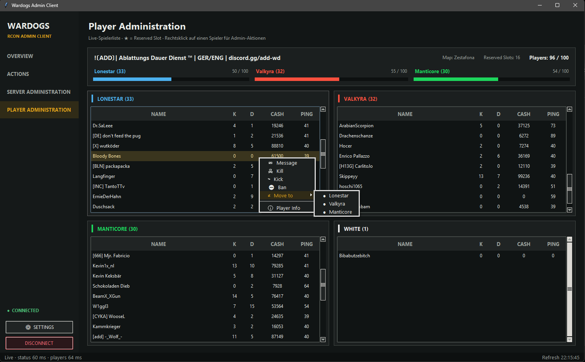
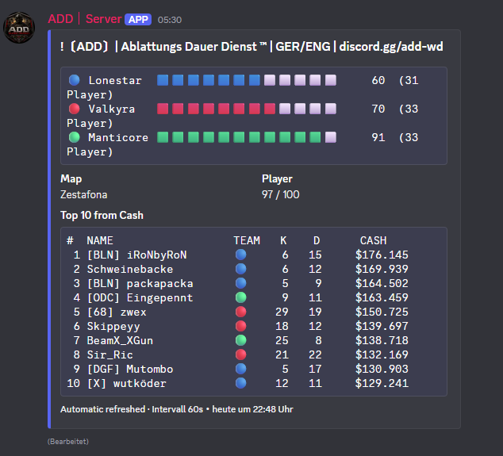

# Wardogs Community Server Tools

A collection of tools I created for managing, moderating, and extending **Wardogs community servers**.

This repository serves as a central overview of the available projects.  
Each tool has its own repository containing the source code, configuration examples, installation instructions, and additional documentation.

## Tools

### RCON Gateway Server

**Repository:** [wd-rcon-gateway-server](https://github.com/tw0f1sh/wd-rcon-gateway-server)

A gateway service that sits between the Wardogs RCON REST API and administrative clients.

Instead of distributing the master RCON password, the gateway allows individual API keys to be created with configurable roles and endpoint permissions.

**Highlights:**
- Keeps the master RCON password on the server
- Individual API keys for administrators and tools
- Role-based permissions
- Per-key endpoint allowlists
- Key expiration, revocation, rotation, and management
- Request logging without exposing secrets
- Designed to work transparently with the existing `/v1` RCON API

---

### RCON Gateway Admin Client

**Repository:** [wd-rcon-gateway-client](https://github.com/tw0f1sh/wd-rcon-gateway-client)

---

  

---

A portable Python GUI for administering a Wardogs server through the RCON API or RCON Gateway.

It provides a visual overview of the server and connected players while exposing common moderation and administration actions without requiring direct API interaction.

**Highlights:**
- Live server and player overview
- Automatic status, player, and reserved-slot updates
- Separate player lists by faction
- Player statistics including kills, deaths, cash, and ping
- Message, kill, kick, ban, and faction-move actions
- Player information and Steam profile access
- Automatic reconnect
- RCON Gateway capability detection
- Optional debug and API administration tools
- Protected credential storage on Windows

---

### Discord Server Status

**Repository:** [wd-discord-status](https://github.com/tw0f1sh/wd-discord-status)

---

  

---

A Discord bot that publishes the current Wardogs server status directly into a Discord channel.

The bot retrieves information from the RCON API and maintains a compact status message for community members.

**Highlights:**
- Server name and current map
- Current/max player count
- Faction scores and player counts
- Visual faction score bars
- Optional player leaderboard
- Sorting by cash, kills, deaths, or ping
- Persistent status message that can be updated automatically
- Configurable update behavior

---

### Welcome & Announcement Bot

**Repository:** [wd-welcome-message](https://github.com/tw0f1sh/wd-welcome-message)

A server-side bot for automatically welcoming newly connected players and sending configurable in-game announcements.

The welcome system detects new players and sends a personal message after they have selected a faction. The announcement system can independently trigger messages based on match time or faction scores.

**Highlights:**
- Automatic welcome messages for newly joined players
- Configurable welcome delay
- Match-based announcements
- Time-based announcement triggers
- Score-based announcement triggers
- Global broadcasts or private messages
- Message queue to prevent overlapping messages
- Per-match announcement tracking

---

### NameGuard

**Repository:** [wd-nameguard](https://github.com/tw0f1sh/wd-nameguard)

A configurable player-name moderation service for Wardogs community servers.

NameGuard continuously checks connected player names and can warn, kick, or ban players when configured naming rules are violated.

**Highlights:**
- Unicode-aware name checking
- Configurable Unicode script restrictions
- Character and symbol blacklists
- Sequence and forbidden-term detection
- Optional separator normalization and Leetspeak matching
- Custom regular expressions
- Configurable warnings and enforcement actions
- Steam ID, exact-name, and regex allowlists
- Persistent moderation state
- Dry-run mode for testing rules safely
- Local name-testing mode

---

## Overview

| Project | Purpose |
| --- | --- |
| **RCON Gateway Server** | Secure access layer for the Wardogs RCON API |
| **RCON Gateway Admin Client** | Desktop GUI for server and player administration |
| **Discord Server Status** | Live server information inside Discord |
| **Welcome & Announcement Bot** | Automated player welcomes and in-game announcements |
| **NameGuard** | Automated player-name moderation |

## Compatibility

The tools were developed around the **Wardogs RCON REST API** and are intended for Wardogs community server administration.

Individual requirements, configuration options, supported API endpoints, and installation instructions can be found in each project's repository.

## Contributions & Issues

If you encounter a problem with a specific tool, please open an issue in the corresponding repository.

Suggestions, improvements, and contributions are welcome.

## Disclaimer

These are community-created tools and are not official Wardogs server software.

Use them at your own risk and always review the configuration before deploying them on a production server.
